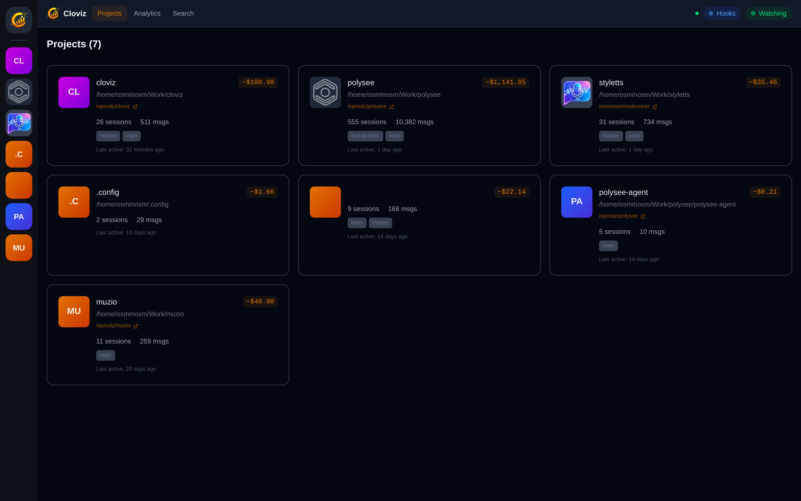
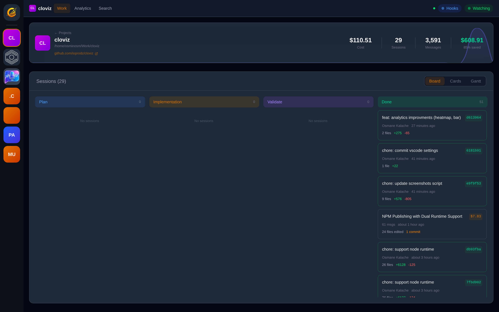
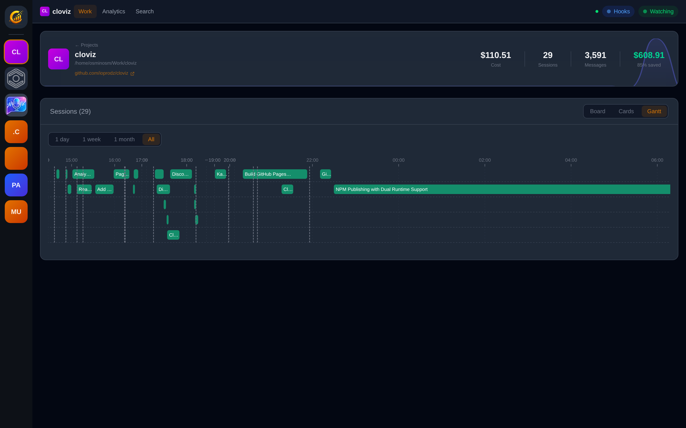
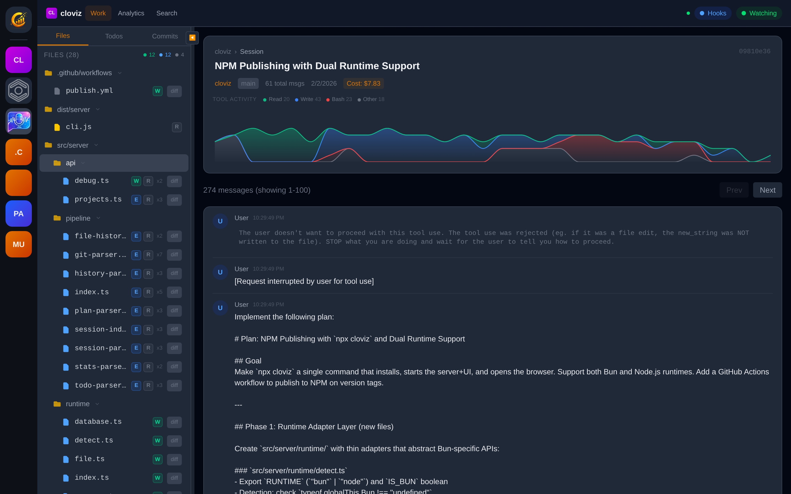
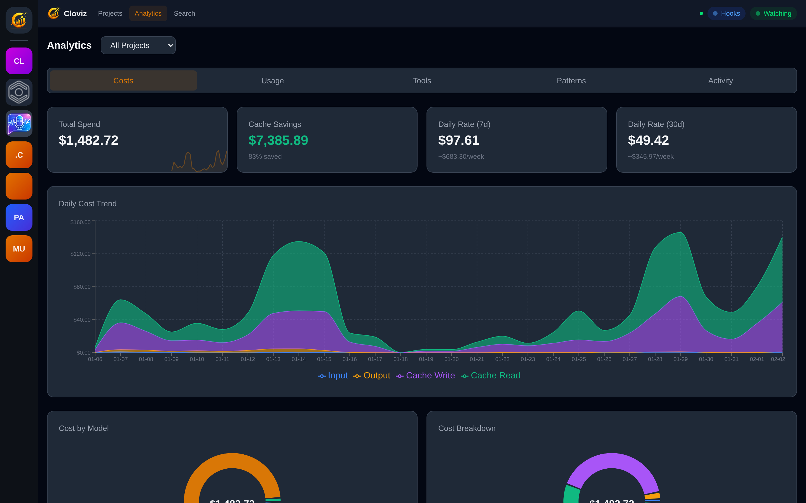
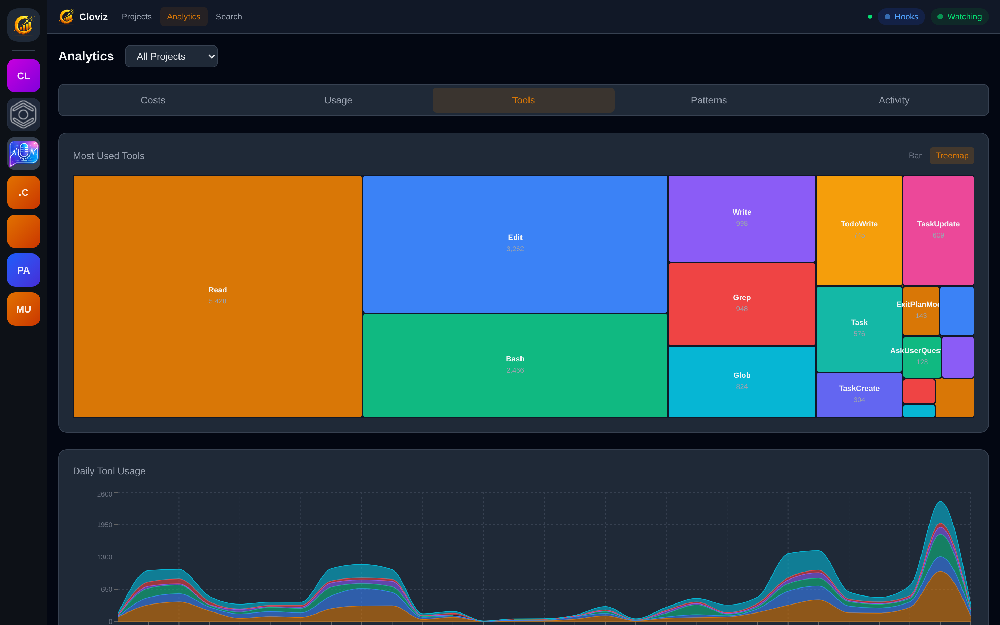
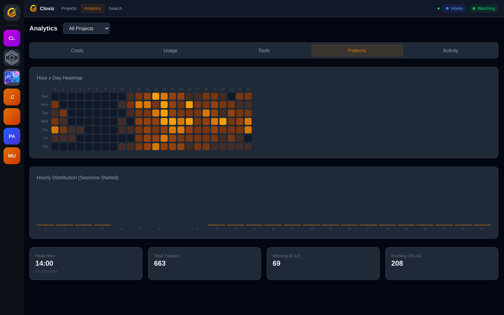

<p align="center">
  
</p>

<h1 align="center">Cloviz</h1>

<p align="center">A local dashboard that indexes your Claude Code sessions, tracks costs, visualizes activity patterns, and helps you understand how you work with AI.</p>

All data stays on your machine. No external services, no telemetry.

### Easy Install

```sh
npx cloviz
```

### Projects Overview


### Kanban Board
Sessions organized by phase with linked commits and cost breakdowns.


### Gantt Timeline
Visualize session durations with 1-day, 1-week, 1-month, and all-time presets.


### Session Replay
Full conversation replay with file tree, diffs, tool usage, and a session activity chart.


### Analytics - Costs
Track total spend, cache savings, daily cost trends, and per-model breakdowns.


### Analytics - Tools
See which tools Claude uses most across your sessions.


### Analytics - Patterns
Hour-by-day heatmap showing when you code with Claude.


## Features

- **Cost Tracking** - Monitor spend across Claude models with daily trends, cache savings, and per-model breakdowns
- **Session Replay** - Step through full conversations with file diffs, tool usage, thinking blocks, and todos
- **Git Integration** - Automatically links commits to sessions and tracks branches and file changes
- **Activity Patterns** - Hour-by-day heatmaps, peak hour detection, and session cadence analysis
- **Full-Text Search** - Search across messages, sessions, and plan files with highlighted results
- **Multiple Views** - Kanban board, Gantt timeline, session cards, and detailed analytics charts
- **Multi-Project** - Per-project analytics with automatic project discovery and logo generation
- **Real-Time Updates** - WebSocket-powered live dashboard with file watcher

## Quick Start

**Prerequisites:** [Bun](https://bun.sh) runtime installed.

```sh
git clone https://github.com/ioprodz/cloviz.git
cd cloviz
bun install
bun run dev
```

The dashboard opens at **http://localhost:3457**. The backend API runs on port 3456.

Cloviz automatically watches `~/.claude` and indexes sessions into a local SQLite database at `~/.cache/cloviz/cloviz.db`.

## Production Build

```sh
bun run build
bun run start
```

This builds the frontend to `dist/client/` and starts the server in production mode at **http://localhost:3456**, serving the SPA and API from the same port.

---

## Contributing

### Project Structure

```
cloviz/
├── src/
│   ├── client/                 # React frontend
│   │   ├── components/         # Reusable UI components
│   │   ├── pages/              # Route-level page components
│   │   ├── hooks/              # Custom React hooks (useApi, useWebSocket, useProjects)
│   │   ├── utils/              # Helpers (formatting, pricing, classification)
│   │   ├── App.tsx             # Router and top-level layout
│   │   ├── main.tsx            # React DOM entry point
│   │   └── index.html          # HTML template
│   └── server/                 # Hono backend (runs on Bun)
│       ├── api/                # API route modules (13 modules)
│       ├── pipeline/           # Data indexing and processing
│       ├── index.ts            # Server entry point
│       ├── db.ts               # SQLite schema and connection
│       ├── watcher.ts          # File system watcher
│       ├── ws.ts               # WebSocket broadcast
│       └── pricing.ts          # Token cost calculations
├── docs/                       # GitHub Pages site
├── package.json
├── tsconfig.json
└── vite.config.ts
```

### Tech Stack

| Layer | Technology |
|-------|-----------|
| Runtime | Bun |
| Frontend | React 19, React Router 7, Tailwind CSS 4, Recharts |
| Backend | Hono |
| Database | SQLite (bun:sqlite) with WAL mode |
| Build | Vite 6, TypeScript 5 |
| File watching | chokidar |

### Development Workflow

#### Running the Dev Environment

```sh
bun run dev
```

This starts two processes concurrently:

- **Backend** (`bun run dev:server`) - Bun with `--watch` flag, auto-restarts on changes to `src/server/`. Runs on port **3456**.
- **Frontend** (`bun run dev:client`) - Vite dev server with HMR. Runs on port **3457** and proxies `/api/*` and `/ws` requests to the backend.

Edit server code and it restarts automatically. Edit client code and the browser hot-reloads.

#### Running Backend or Frontend Independently

```sh
# Server only
bun run dev:server

# Client only (requires backend already running on :3456)
bun run dev:client
```

#### Preview a Production Build Locally

```sh
bun run preview
```

This builds the frontend and starts the server in production mode, serving everything from port 3456.

### Path Aliases

TypeScript path aliases are configured in `tsconfig.json`:

- `@server/*` maps to `src/server/*`
- `@client/*` maps to `src/client/*`

### Database

The SQLite database is created automatically on first run at `~/.cache/cloviz/cloviz.db`. The schema is defined and migrated in `src/server/db.ts`.

Key tables: `projects`, `sessions`, `messages`, `tool_uses`, `commits`, `session_commits`, `plans`, `todos`, `file_history`, `daily_stats`, `index_state`.

Full-text search uses SQLite FTS5 virtual tables (`messages_fts`, `sessions_fts`, `plans_fts`).

To reset the database, delete the file and restart:

```sh
rm ~/.cache/cloviz/cloviz.db
bun run dev
```

### Indexing Pipeline

On startup, a **quick index** runs synchronously before the server begins listening:

1. Scans `~/.claude/stats-cache.json` for session metadata
2. Indexes session files and parses `history.jsonl`
3. Scans plan documents and project logos
4. Reads git remote URLs for project linking

A **background index** then processes session JSONL content (files under 2MB are parsed immediately; larger files are lazy-loaded on demand).

The **file watcher** monitors `~/.claude` for changes, debounces with a 200ms stability threshold, and broadcasts updates over WebSocket.

### Adding a New API Endpoint

1. Create a new file in `src/server/api/` (or add to an existing one).
2. Export a Hono app instance with your routes:

```ts
import { Hono } from "hono";
import { getDb } from "../db";

const app = new Hono();

app.get("/my-endpoint", (c) => {
  const db = getDb();
  // query and return data
  return c.json({ data: [] });
});

export default app;
```

3. Mount it in `src/server/index.ts`:

```ts
import myRoutes from "./api/my-routes";
app.route("/api/my-routes", myRoutes);
```

### Adding a New Frontend Page

1. Create a new page component in `src/client/pages/`.
2. Add a route in `src/client/App.tsx` inside the router configuration.
3. Add a nav link in the navigation bar component if it should be globally accessible.

### Adding a New Component

Place reusable components in `src/client/components/`. The project uses Tailwind CSS for styling - follow the existing patterns (dark theme with `gray-900` base, indigo/cyan accent colors).

### Environment Variables

| Variable | Default | Description |
|----------|---------|-------------|
| `PORT` | `3456` | Backend server port |
| `NODE_ENV` | — | Set to `production` to serve static files from `dist/client/` |

No `.env` file is needed. The project uses hardcoded paths (`~/.claude` for session data, `~/.cache/cloviz` for the database).

### Conventions

- TypeScript strict mode is enabled
- Frontend uses functional components with hooks
- Backend uses Hono's routing pattern with modular route files
- Database queries use raw SQL via `bun:sqlite`
- Dates are handled with `date-fns`
- Charts use Recharts with a consistent dark theme

### Common Tasks

| Task | Command |
|------|---------|
| Start development | `bun run dev` |
| Build for production | `bun run build` |
| Run production server | `bun run start` |
| Preview production build | `bun run preview` |
| Reset database | `rm ~/.cache/cloviz/cloviz.db` |
| Install dependencies | `bun install` |

## License

MIT
